# EX-06-Feature-Transformation

## AIM
To Perform the various feature transformation techniques on a dataset and save the data to a file. 

# Explanation
Feature Transformation is a mathematical transformation in which we apply a mathematical formula to a particular column(feature) and transform the values which are useful for our further analysis.

 
# ALGORITHM
### STEP 1
Read the given Data
### STEP 2
Clean the Data Set using Data Cleaning Process
### STEP 3
Apply Feature Transformation techniques to all the feature of the data set
### STEP 4
Save the data to the file


# CODE:
```
import pandas as pd
import numpy as np
import matplotlib.pyplot as plt
import seaborn as sns
import statsmodels.api as sm
import scipy.stats as stats

df=pd.read_csv("Data_To_Transform.csv")
df

df.skew()

np.log(df["Highly Positive Skew"])

np.reciprocal(df["Moderate Positive Skew"])

np.sqrt(df["Highly Positive Skew"])

np.square(df["Highly Negative Skew"])

df["Highly Positive Skew_boxcox"], parameters=stats.boxcox(df["Highly Positive Skew"])
df

df["Moderate Positive Skew_yeojohnson"], parameters=stats.yeojohnson(df["Moderate Positive Skew"])
df

df["Moderate Negative Skew_yeojohnson"], parameters=stats.yeojohnson(df["Moderate Negative Skew"])
df

df["Highly Negative Skew_yeojohnson"], parameters=stats.yeojohnson(df["Highly Negative Skew"])
df

df.skew()

from sklearn.preprocessing import QuantileTransformer 
qt=QuantileTransformer(output_distribution='normal')

df["Moderate Negative Skew_1"]=qt.fit_transform(df[["Moderate Negative Skew"]])
sm.qqplot(df['Moderate Negative Skew'],line='45')
plt.show()

sm.qqplot(df['Moderate Negative Skew_1'],line='45')
plt.show()

df["Highly Negative Skew_1"]=qt.fit_transform(df[["Highly Negative Skew"]])
sm.qqplot(df['Highly Negative Skew'],line='45')
plt.show()

sm.qqplot(df['Highly Negative Skew_1'],line='45')
plt.show()

df["Moderate Positive Skew_1"]=qt.fit_transform(df[["Moderate Positive Skew"]])
sm.qqplot(df['Moderate Positive Skew'],line='45')
plt.show()

sm.qqplot(df['Moderate Positive Skew_1'],line='45')
plt.show()

df["Highly Positive Skew_1"]=qt.fit_transform(df[["Highly Positive Skew"]])
sm.qqplot(df['Highly Positive Skew'],line='45')
plt.show()

sm.qqplot(df['Highly Positive Skew_1'],line='45')
plt.show()

df
```
# OUPUT:

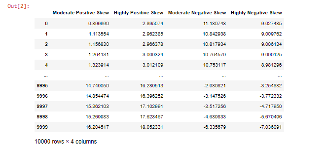

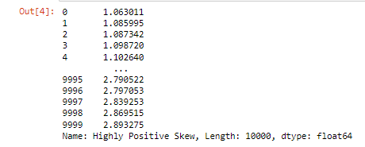

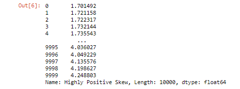


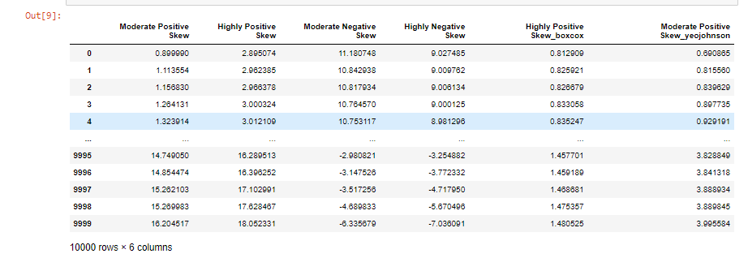
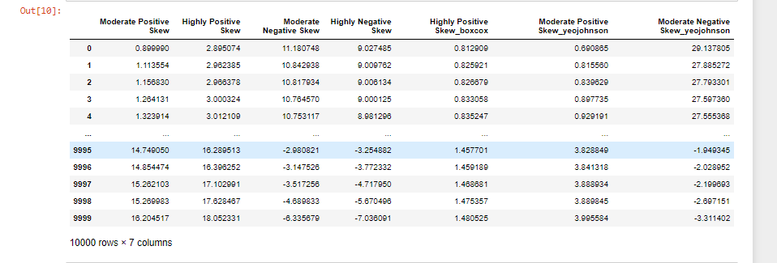
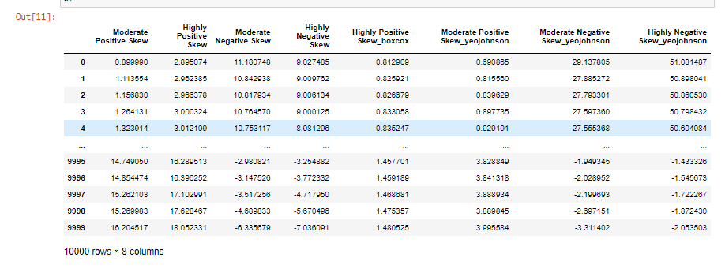


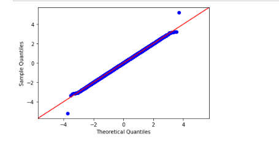

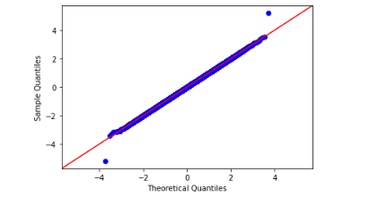

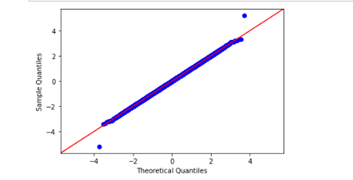

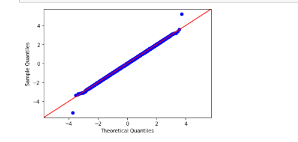
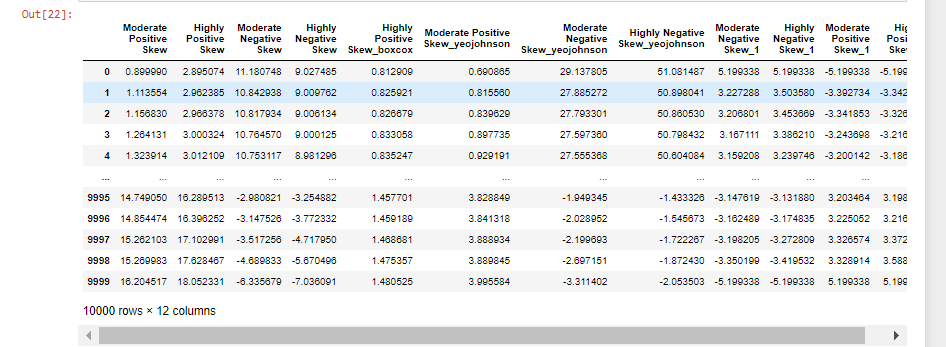
# OUTPUT FOR titanic_dataset.csv:


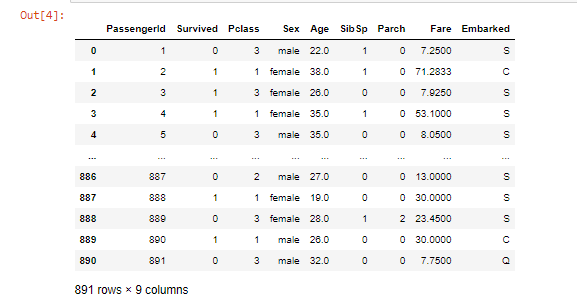
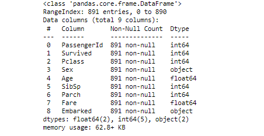


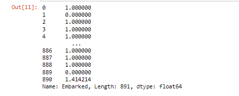
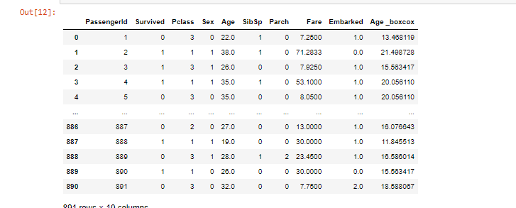
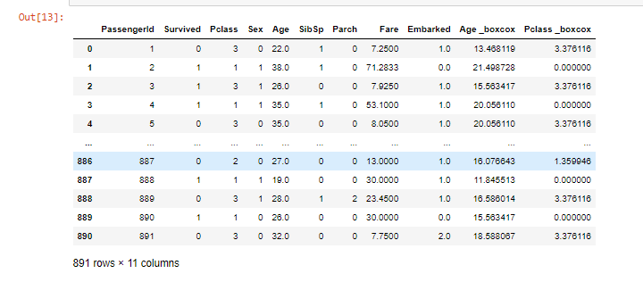


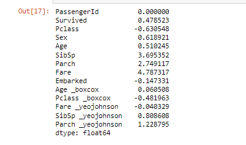
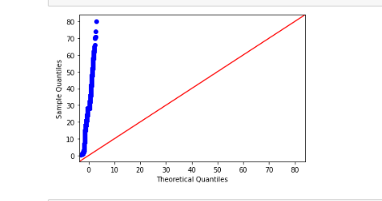


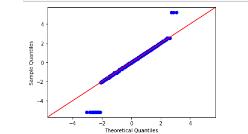
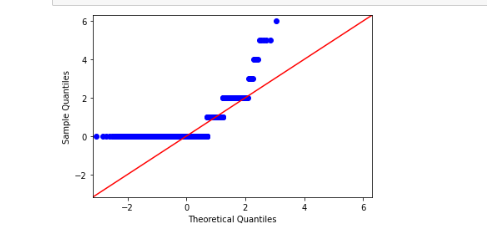

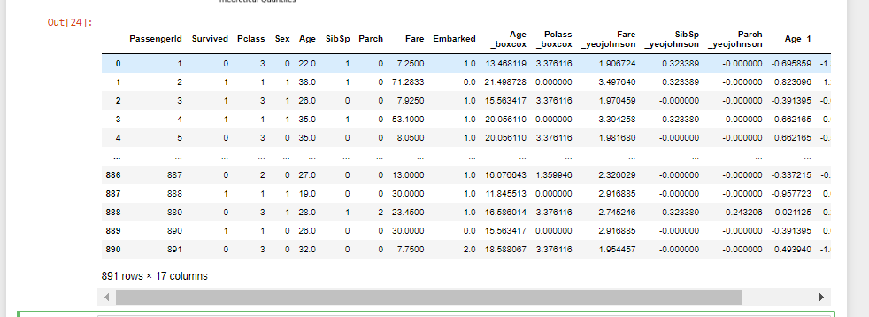
# RESULT: 
The various feature transformation techniques has been performed on the given datasets and the data are saved to a file.